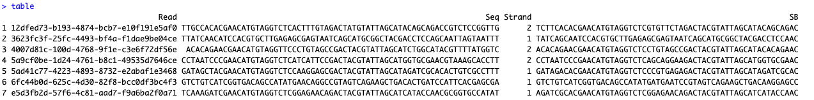

# SinONTbar
A R package designed for singleron and ONT data barcode assignment

# Requirements
B2B (https://github.com/tangchao7498/CBUC) \
Biostrings \
IRanges \
rDNAse \
data.table \
ShortRead \
DECIPHER

# Installation
Your can install B2B from GitHub by:

```
library(devtools)
devtools::install_github("zhangdannn/SinONTabr")
```

# Run example
```
library(SinONTbar)
library(B2B)
library(data.table)
library(ShortRead)
library(Biostrings)
library(DECIPHER)

table = SinONTbar::BarcodeAssign(ONTfastq = system.file("data", "nanopore_small.fq", package = "SinONTbar"),
              Sinbarcode = system.file("data", "Singleron.barcodes.tsv.gz", package = "SinONTbar"),
              MaxMisMatchvalue = 10)
```



# Run example2

```
  BsTab = PattafourSeq(ONTfastq = system.file("data", "nanopore_small.fq", package = "SinONTbar"))
  Sinbarcode = system.file("data", "Singleron.barcodes.tsv.gz", package = "SinONTbar")
  BCs <-DNAStringSet(BsTab$Seq)
  names(BCs) <- BsTab$Read
  BCs <- BCs[width(BCs) >= 65]
  NGS <- fread(Sinbarcode, header = FALSE)
  ONTSB <- subseq(BCs, 1, 57)
  NGSSB <- DNAStringSet(unique(NGS$V1))
  MaxMisMatchvalue = 10
  ONT2NGS <- mclapply(seq_along(ONTSB), function(i) B2B:::MatchSB2(ONT = ONTSB[[i]], SB = NGSSB, MaxMisMatch = MaxMisMatchvalue), mc.cores = 1)
  ONT2NGS <- as.data.frame(data.table(Read = names(ONTSB), SB = mapply(as.character, ONT2NGS)))
  ONT2NGS <- ONT2NGS[!is.na(ONT2NGS$SB), ]
  R2B0 <- merge(BsTab, ONT2NGS, by = "Read")
  ```
